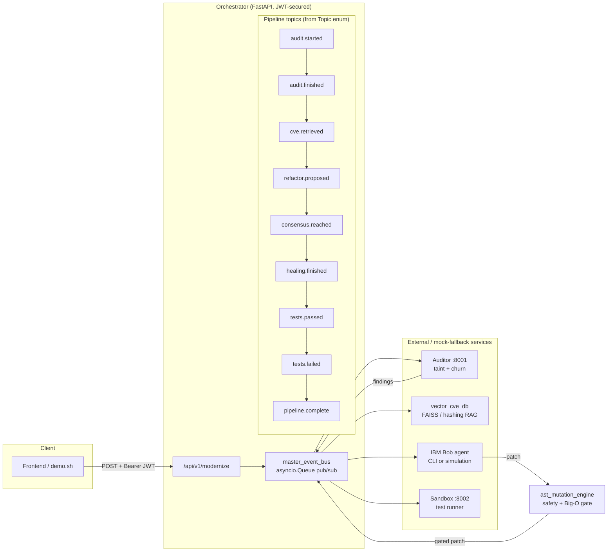
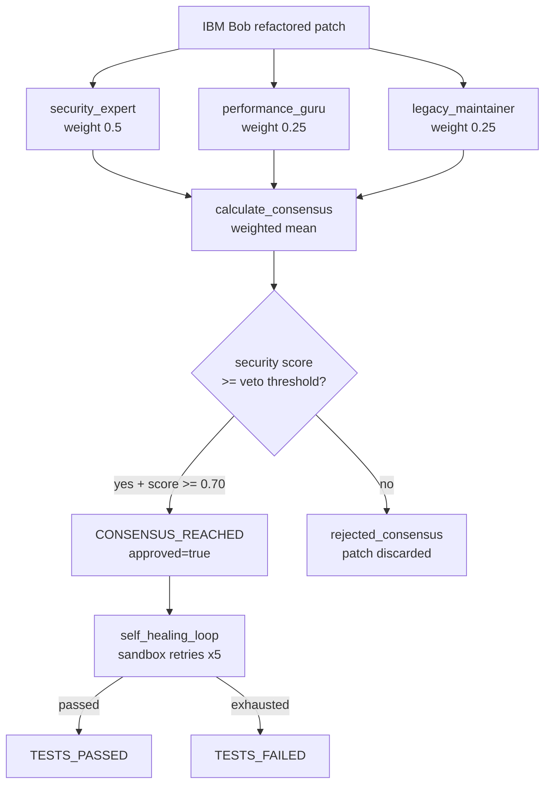

<!-- GENERATED BY services/orchestrator/auto_doc_generator.py — DO NOT EDIT BY HAND. Regenerate: python auto_doc_generator.py -->

# Architecture — Automated Enterprise Legacy & Security Modernizer

*Generated 2026-09-26 17:14 UTC by `auto_doc_generator.py` from live code introspection.*

## System overview

## Multi-agent consensus loop

Every IBM Bob patch must survive a weighted debate before it can ship. The
Security Expert holds a veto that no average can overrule.

## Event bus topics (pipeline lifecycle)

| # | Topic | Meaning |
| --- | --- | --- |
| 0 | `AUDIT_STARTED` (`audit.started`) | stage of the modernization pipeline |
| 1 | `AUDIT_FINISHED` (`audit.finished`) | stage of the modernization pipeline |
| 2 | `CVE_RETRIEVED` (`cve.retrieved`) | stage of the modernization pipeline |
| 3 | `REFACTOR_PROPOSED` (`refactor.proposed`) | stage of the modernization pipeline |
| 4 | `CONSENSUS_REACHED` (`consensus.reached`) | stage of the modernization pipeline |
| 5 | `HEALING_FINISHED` (`healing.finished`) | stage of the modernization pipeline |
| 6 | `TESTS_PASSED` (`tests.passed`) | stage of the modernization pipeline |
| 7 | `TESTS_FAILED` (`tests.failed`) | stage of the modernization pipeline |
| 8 | `PIPELINE_COMPLETE` (`pipeline.complete`) | stage of the modernization pipeline |

## API surface (read live from `main.app`)

| Path | Methods | Auth | Response model |
| --- | --- | --- | --- |
| `/` | GET | public | `Dict` |
| `/api/v1/modernize` | POST | 🔒 JWT (`modernizer` role) | `ModernizationResponse` |
| `/api/v1/stream-logs` | GET | public | `—` |
| `/docs` | GET | public | `—` |
| `/docs/oauth2-redirect` | GET | public | `—` |
| `/health` | GET | public | `Dict` |
| `/metrics` | GET | public | `—` |
| `/openapi.json` | GET | public | `—` |
| `/redoc` | GET | public | `—` |

## Subsystem registry

| Module | Responsibility |
| --- | --- |
| `main.py` | FastAPI front door; HTTP <-> event bus; JWT-secured master route; SSE streaming |
| `master_event_bus.py` | asyncio.Queue pub/sub router; fan-out, backpressure, race-free drain |
| `vector_cve_db.py` | In-memory CVE vector DB; sentence-transformers/FAISS with hashing fallback |
| `multi_agent_consensus.py` | 3-persona debate; weighted consensus + security veto |
| `ast_mutation_engine.py` | AST gate: dangerous-builtin blocklist + loop-depth Big-O guard |
| `self_healing_loop.py` | Sandbox retry loop; traceback parsing; exponential backoff |
| `roi_calculator.py` | Hours / dollars / CO2e business-value model; auditable assumptions |
| `observability_exporter.py` | Prometheus Counter/Histogram/Gauge + /metrics scrape endpoint |
| `cross_language_parser.py` | Polyglot scanning: Python AST + JS/TS/Java security rules |
| `enterprise_auth.py` | OAuth2 password grant + HS256 JWT (jose or stdlib HMAC) |
| `chaos_monkey_tester.py` | Fault-injection suite proving graceful degradation |

## Data schemas (read live from Pydantic models)

### Orchestrator API (main.py)

#### `ModernizationRequest`

| Field | Type | Required |
| --- | --- | --- |
| `repo_path` | `str` | yes |
| `target_version` | `str` | yes |

#### `VulnerabilityItem`

| Field | Type | Required |
| --- | --- | --- |
| `file_path` | `str` | yes |
| `line_number` | `int` | yes |
| `description` | `str` | yes |
| `severity` | `str` | yes |

#### `RefactorResult`

| Field | Type | Required |
| --- | --- | --- |
| `original_code` | `str` | yes |
| `refactored_code` | `str` | yes |
| `status` | `str` | yes |
| `consensus_score` | `Optional[float]` | no |
| `ast_violations` | `List[str]` | no |
| `healing_attempts` | `Optional[int]` | no |
| `loop_depth_before` | `int` | no |
| `loop_depth_after` | `int` | no |

#### `ModernizationResponse`

| Field | Type | Required |
| --- | --- | --- |
| `repo_path` | `str` | yes |
| `target_version` | `str` | yes |
| `auditor_source` | `str` | yes |
| `sandbox_source` | `str` | yes |
| `vulnerabilities` | `List[VulnerabilityItem]` | yes |
| `cve_hits` | `List[Dict[str, Any]]` | yes |
| `refactors` | `List[RefactorResult]` | yes |
| `sandbox_report` | `Dict[str, Any]` | yes |
| `roi_summary` | `ROISummary` | yes |
| `pipeline_success` | `bool` | yes |
| `execution_logs` | `List[str]` | yes |
| `event_timeline` | `List[str]` | yes |
| `duration_ms` | `int` | yes |

### RAG Security Engine (vector_cve_db.py)

#### `CVEItem`

| Field | Type | Required |
| --- | --- | --- |
| `cve_id` | `str` | yes |
| `package` | `str` | yes |
| `affected_versions` | `str` | yes |
| `severity` | `str` | yes |
| `description` | `str` | yes |
| `fixed_version` | `Optional[str]` | no |

#### `CVEQueryResult`

| Field | Type | Required |
| --- | --- | --- |
| `cve` | `CVEItem` | yes |
| `score` | `float` | yes |

### Self-Healing Engine (self_healing_loop.py)

#### `SandboxResult`

| Field | Type | Required |
| --- | --- | --- |
| `passed` | `bool` | yes |
| `traceback` | `Optional[str]` | no |
| `source` | `str` | yes |
| `details` | `Dict[str, Any]` | no |

#### `TracebackInfo`

| Field | Type | Required |
| --- | --- | --- |
| `exception_type` | `str` | no |
| `message` | `str` | no |
| `file_path` | `Optional[str]` | no |
| `line_number` | `Optional[int]` | no |

#### `HealAttempt`

| Field | Type | Required |
| --- | --- | --- |
| `attempt` | `int` | yes |
| `sandbox_passed` | `bool` | yes |
| `sandbox_source` | `str` | yes |
| `exception_type` | `Optional[str]` | no |
| `fix_applied` | `bool` | no |
| `ast_gate_passed` | `Optional[bool]` | no |
| `note` | `str` | no |

#### `HealResult`

| Field | Type | Required |
| --- | --- | --- |
| `success` | `bool` | yes |
| `final_code` | `str` | yes |
| `attempts` | `List[HealAttempt]` | yes |
| `total_attempts` | `int` | yes |
| `log` | `List[str]` | yes |

### Business Value Engine (roi_calculator.py)

#### `ROIBreakdownItem`

| Field | Type | Required |
| --- | --- | --- |
| `file_hint` | `str` | yes |
| `lines_changed` | `int` | yes |
| `severity` | `str` | yes |
| `loop_depth_before` | `int` | yes |
| `loop_depth_after` | `int` | yes |
| `hours_saved` | `float` | yes |
| `cost_saved_usd` | `float` | yes |
| `carbon_kg_co2e_per_year` | `float` | yes |

#### `ROISummary`

| Field | Type | Required |
| --- | --- | --- |
| `total_hours_saved` | `float` | yes |
| `total_cost_saved_usd` | `float` | yes |
| `total_carbon_kg_co2e_per_year` | `float` | yes |
| `refactors_analyzed` | `int` | yes |
| `hourly_rate_usd` | `float` | yes |
| `assumptions` | `Dict[str, Any]` | yes |
| `breakdown` | `List[ROIBreakdownItem]` | yes |

### Polyglot Parser (cross_language_parser.py)

#### `PolyglotFinding`

| Field | Type | Required |
| --- | --- | --- |
| `file_path` | `str` | yes |
| `line_number` | `int` | yes |
| `description` | `str` | yes |
| `severity` | `str` | yes |
| `language` | `Language` | yes |
| `rule_id` | `str` | yes |

### Zero-Trust Auth (enterprise_auth.py)

#### `TokenResponse`

| Field | Type | Required |
| --- | --- | --- |
| `access_token` | `str` | yes |
| `token_type` | `str` | no |
| `expires_in` | `int` | yes |

#### `EnterpriseUser`

| Field | Type | Required |
| --- | --- | --- |
| `username` | `str` | yes |
| `role` | `str` | yes |
| `exp` | `int` | yes |

## Resilience

See `chaos_monkey_tester.py` — four fault-injection scenarios (Bob timeout,
AST parser crash, sandbox OOM, transport-level 500 contract) all prove the
orchestrator degrades gracefully and never hangs.
